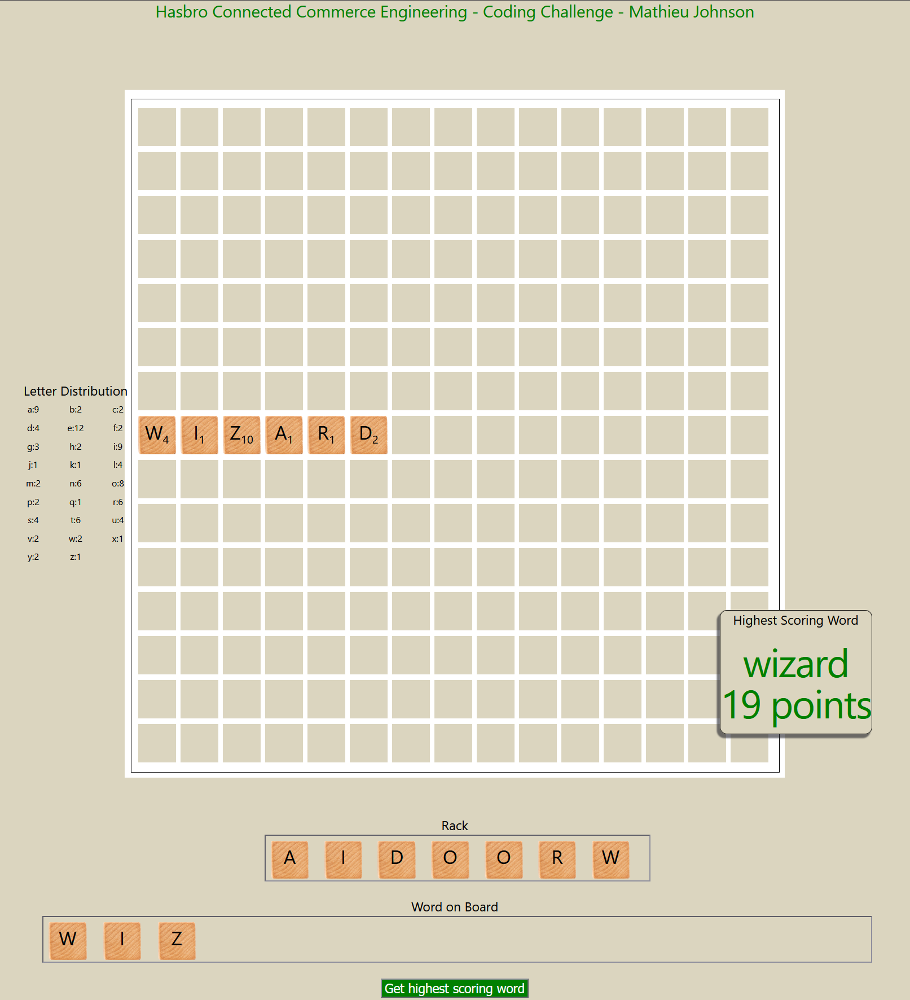
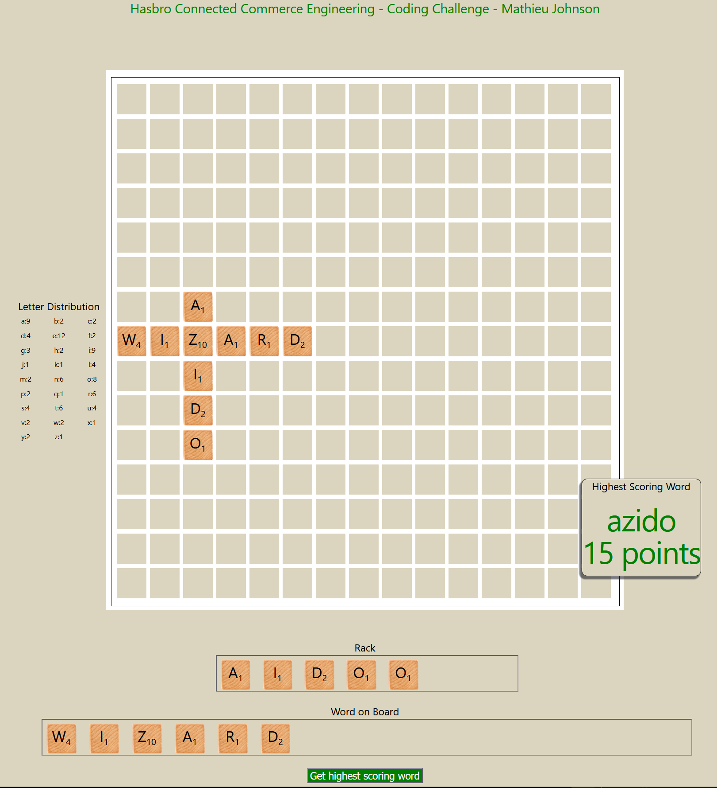
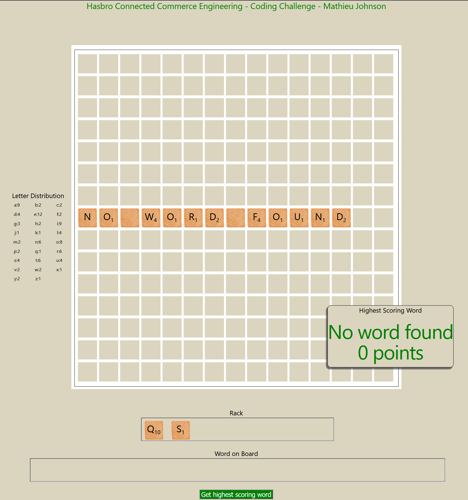

# Hasbro Scrabble Word Builder

### Full stack app (FastAPI + Vite React Typescript)

Tech Stack

- backend: FastAPI, python 3.14
- Frontend React, Typescript, Vite 8
- Api: Rest (JSON)
- Package managers: uv / npm

## Setup & Installation

1. Clone the repository

```
git clone https://github.com/mathieujohnson/Hasbro_Scrabble_Word_Builder.git
cd Hasbro_Scrabble_Word_Builder
```

2. Setup the backend

```
cd api
uv sync
```

activate the virtual environment

on linux:`source .venv/bin/activate`

on windows: `.venv\Scripts\activate`

Run the backend server

```
python main.py
```

The api will be available at [http://localhost:8000](http://localhost:8000)

3. Frontend setup
   in a new terminal/command line from the Hasbro_Scrabble_Word_Builder folder root.

```
cd frontend

npm install
```

Run the frontend

```
npm run dev
```

The frontend will be available at [http://localhost:5173](http://localhost:5173)

## Usage Guidelines

The api has two main endpoints:

```
http://localhost:8000/rack/{rack}/word/{word}
``` 

and

```
http://localhost:8000/rack/{rack}
```

which provide the basis for getting the highest scored word using the characters (and word) supplied.

- When no word is given, the server tries to match the characters from the rack to the dictionary trying all
  permutations with a minimum of 2 characters and responds with either no match or the score and word found.
- When a word is supplied, it uses the word to try and create a longer word with 1 to 7 of the provided characters
  appending or pre-pending the string to the complete word. It also tries to use a single letter from the word to create
  and match with a new word using 1 to 7 of the provided characters from the rack. It keeps the highest scored match if
  one is found in either of these scenarios.

The application can be used via api only, or the frontend can be access for a more user-friendly experience.
The frontend provides a display of the tiles on a board and as you type them for the rack and the word. The frontend
limits the number of characters that can be entered in the inputs, but the api doesn't have a limit therefore the
backend returns an error message in that case.
The other error cases are reported back to the frontend.

## Frontend Screenshots



## Assumptions

### technical assumptions

- UV is installed, if not it can be done via these [docs](https://docs.astral.sh/uv/getting-started/installation/)
- UV should pull python 3.14 for you, but depending on the installation method, you might need a python install,
  something like 3.11+ should do just fine.
- node.js 20.19+, 22.12+ is available for vite 8 to work.
- Ports 8000 and 5173 are open and available

### project assumptions

- I assume that the word input is a valid word. If it's not, it will still probably return a valid word that crosses
  vertically with the "word" (horizontal) but it will not error out on the invalid word.
- I assume that no white space or special characters that are not in the letter_data.json will be entered. (an error
  message saying there's 0 of that character is returned if tried). There is no mechanism in place to prevent that.

## Design decisions

I started this project with the backend. I chose python as I thought I might need the [NLTK](https://www.nltk.org/) but
as it turns out I was able to get it done with itertools' permutations only.
Fast API was an easy choice for the size of the project. I decided to add a frontend to see if I could line up the words
on a board. It was an opportunity to try the new version of vite!
The server responds decently fast for smaller words, but I did observe longer response times when maxing out
the word and rack lengths (around 4-5 seconds). Enough time that a loading animation would be warranted, I think.
I started this project with just a couple words in my dictionary.txt: the exemples from the doc and a couple more. I
quickly wanted more words, so I tried to get some using Merriam-Webster's scrabble [list](https://scrabble.merriam.com/word-lists) but it got tedious
quickly. I ended up finding the *ENABLE* dictionary (words with friends) and in particular,
this [github repo](https://github.com/MagicOctopusUrn/wordListsByLength) which has them by word length!
The tile distribution and value points were easy to find, and I did try to play with it a bit to see how it reacted to
changes in scores and tile quantities.
For the frontend, I started from the vite starter project and modified it, starting with simple api calls, then adding the form. Eventually adding the board layout and displaying tiles to make it pretty.
I worked with inline styles to juggle less files but eventually cleaned it up.
I thought about adding buttons to generate rack and word as if we were drawing tiles like in scrabble but I stopped myself, otherwise I might have had the idea to code the whole game!
